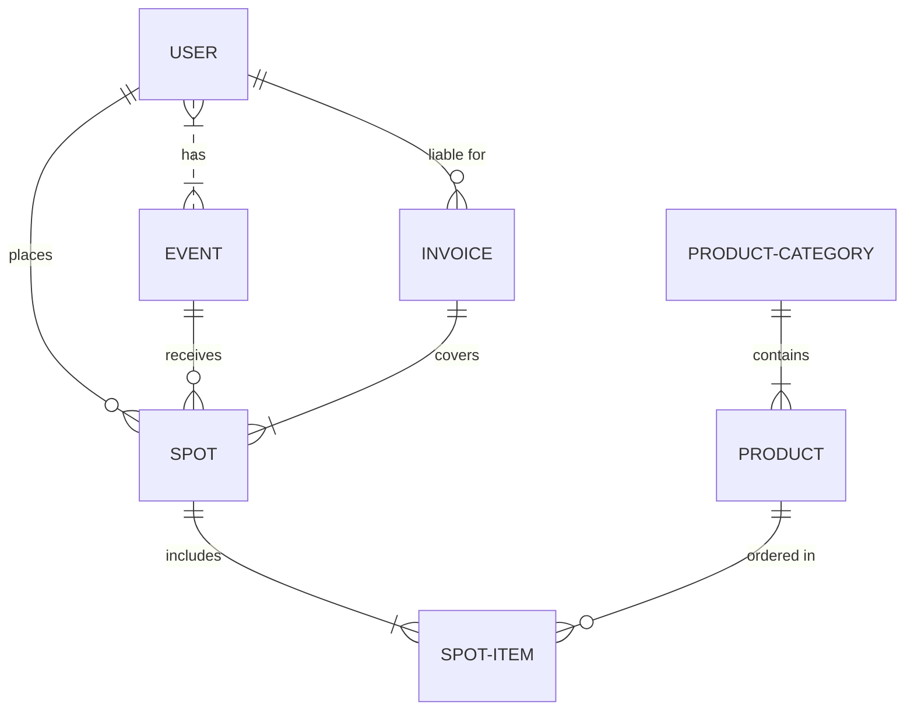

# Entity relation diagram

```mermaid 
erDiagram
          USER }|..|{ EVENT : has
          USER ||--o{ SPOT : places
          USER ||--o{ INVOICE : "liable for"
          EVENT ||--o{ SPOT : receives
          INVOICE ||--|{ SPOT : covers
          SPOT ||--|{ SPOT-ITEM : includes
          PRODUCT-CATEGORY ||--|{ PRODUCT : contains
          PRODUCT ||--o{ SPOT-ITEM : "ordered in"
```